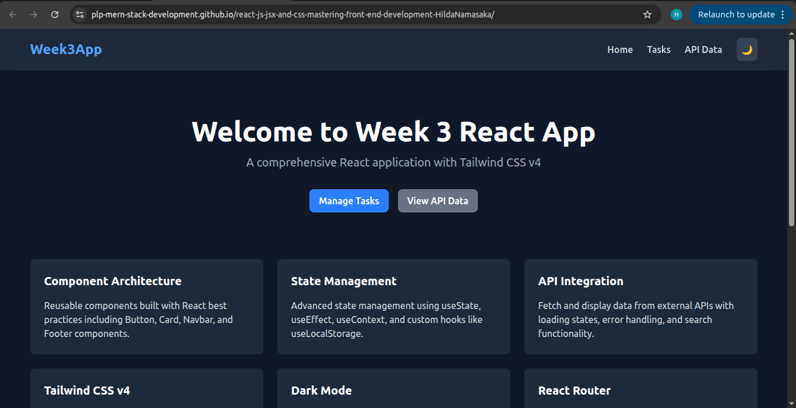

## my documentation
# Week 3 React App - My Submission

## Live Demo
 **Deployed URL:** https://plp-mern-stack-development.github.io/react-js-jsx-and-css-mastering-front-end-development-HildaNamasaka/

## Screenshots
### Home Page (Dark Mode)


### Task Manager


## Setup Instructions

### Prerequisites
- Node.js (v18 or higher)
- npm (Node Package Manager)

### Installation Steps

1. **Clone the repository:**
```bash
git clone https://github.com/PLP-MERN-Stack-Development/react-js-jsx-and-css-mastering-front-end-development-HildaNamasaka.git
cd react-js-jsx-and-css-mastering-front-end-development-HildaNamasaka
```

2. **Install dependencies:**
npm install
```

3. **Run the development server:**
npm run dev
```

4. **Open your browser:**
Navigate to `http://localhost:5173`

### Building for Production

To create a production build:
npm run build
```

The build output will be in the `dist` folder.

### Deploying to GitHub Pages

To deploy the application:

npm run deploy
```

This will build the project and push it to the `gh-pages` branch.

## Features Implemented

### Task 1: Project Setup 
- React application created with Vite
- Tailwind CSS v4 installed and configured
- Project structure organized with components, pages, and context folders
- React Router configured for client-side routing

### Task 2: Component Architecture 
- **Button Component:** Reusable button with primary, secondary, and danger variants
- **Card Component:** Content display in boxed layouts
- **Navbar Component:** Site navigation with routing
- **Footer Component:** Links and copyright information
- **Layout Component:** Wrapper including Navbar and Footer

### Task 3: State Management and Hooks 
- **TaskManager Component:** 
  - Add new tasks
  - Mark tasks as completed
  - Delete tasks
  - Filter tasks (All, Active, Completed)
- **React Hooks Used:**
  - `useState` for component state management
  - `useEffect` for loading saved tasks
  - `useContext` for theme management (light/dark mode)
  - Custom `useLocalStorage` hook for task persistence

### Task 4: API Integration 
- Fetches data from JSONPlaceholder API
- Displays data in responsive grid layout
- Loading states with spinner
- Error handling with user-friendly messages
- Search functionality to filter results
- Pagination support

### Task 5: Styling with Tailwind CSS 
- Responsive design (mobile, tablet, desktop)
- Dark/Light theme switcher using Tailwind's dark mode
- Utility classes for layout, spacing, typography, and colors
- Custom animations and transitions
- Modern card-based layouts

## Technologies Used

- **React 19** - UI library
- **Vite 7** - Build tool and development server
- **Tailwind CSS v4** - Utility-first CSS framework
- **React Router v7** - Client-side routing
- **JSONPlaceholder API** - Mock REST API for testing

## Project Structure
```
├── src/
│   ├── components/      # Reusable UI components
│   │   ├── Button.jsx
│   │   ├── Card.jsx
│   │   ├── Navbar.jsx
│   │   ├── Footer.jsx
│   │   ├── Layout.jsx
│   │   └── TaskManager.jsx
│   ├── pages/          # Page components
│   │   ├── Home.jsx
│   │   ├── Tasks.jsx
│   │   └── ApiData.jsx
│   ├── context/        # React Context
│   │   └── ThemeContext.jsx
│   ├── hooks/          # Custom hooks
│   │   └── useLocalStorage.js
│   ├── App.jsx         # Main app component
│   ├── main.jsx        # Entry point
│   └── index.css       # Tailwind imports
├── public/             # Static assets
├── index.html          # HTML template
├── vite.config.js      # Vite configuration
└── package.json        # Dependencies and scripts


## Available Scripts

- `npm run dev` - Start development server
- `npm run build` - Build for production
- `npm run preview` - Preview production build locally
- `npm run deploy` - Deploy to GitHub Pages


##################################################################

## React + Vite

This template provides a minimal setup to get React working in Vite with HMR and some ESLint rules.

Currently, two official plugins are available:

- [@vitejs/plugin-react](https://github.com/vitejs/vite-plugin-react/blob/main/packages/plugin-react) uses [Babel](https://babeljs.io/) (or [oxc](https://oxc.rs) when used in [rolldown-vite](https://vite.dev/guide/rolldown)) for Fast Refresh
- [@vitejs/plugin-react-swc](https://github.com/vitejs/vite-plugin-react/blob/main/packages/plugin-react-swc) uses [SWC](https://swc.rs/) for Fast Refresh

## React Compiler

The React Compiler is enabled on this template. See [this documentation](https://react.dev/learn/react-compiler) for more information.

Note: This will impact Vite dev & build performances.

## Expanding the ESLint configuration

If you are developing a production application, we recommend using TypeScript with type-aware lint rules enabled. Check out the [TS template](https://github.com/vitejs/vite/tree/main/packages/create-vite/template-react-ts) for information on how to integrate TypeScript and [`typescript-eslint`](https://typescript-eslint.io) in your project.
